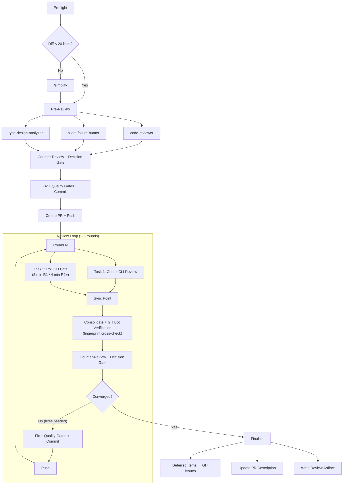
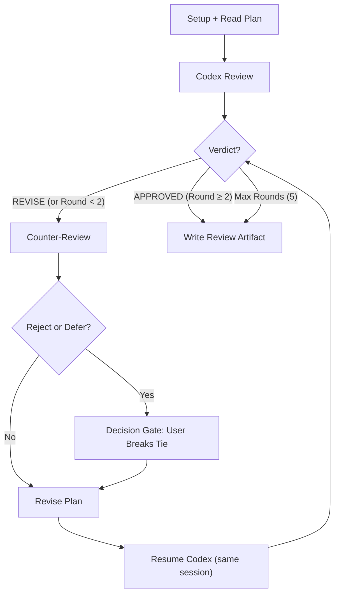
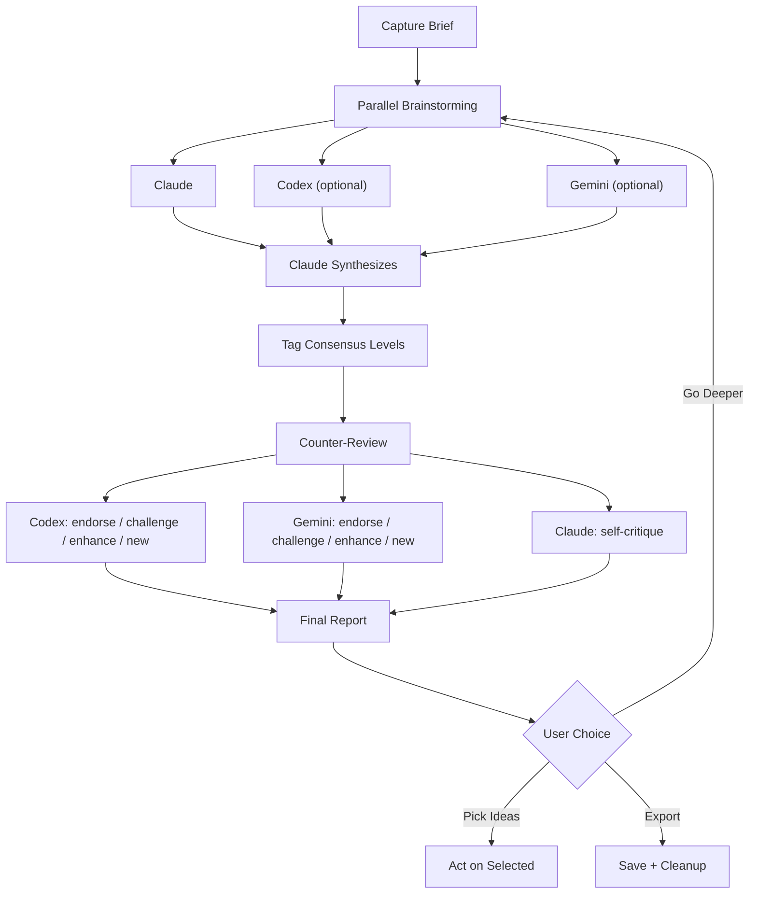
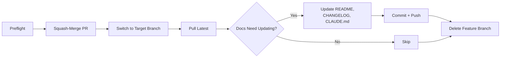
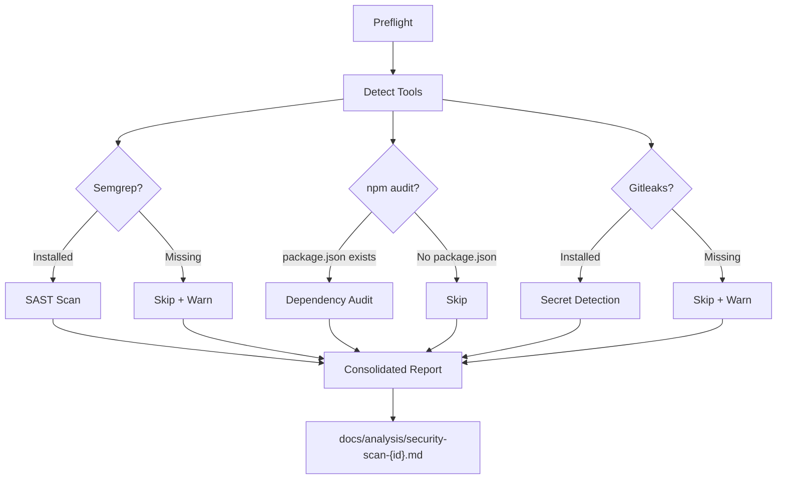
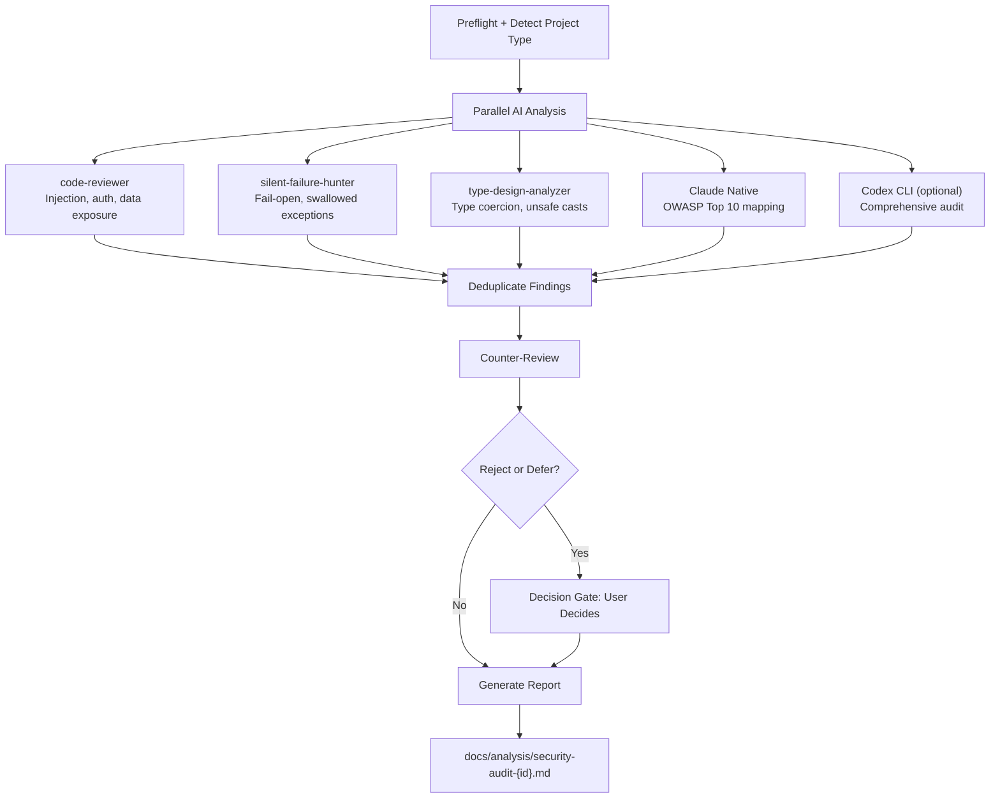
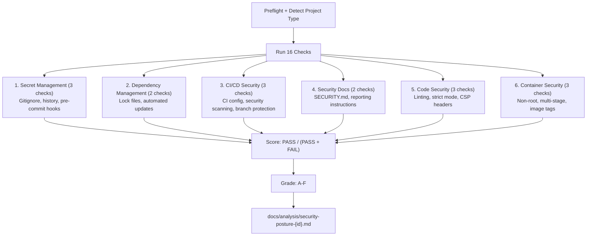
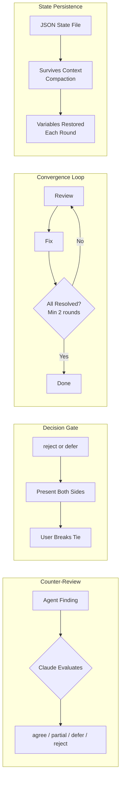

# Skills Guide

Visual flow diagrams for every skill in the Agentic Engineering toolkit. For detailed descriptions and setup instructions, see the [README](../README.md).

## Quick Navigation

| Category | Skills | Pattern |
|----------|--------|---------|
| Collaboration | `/peer-review-code`, `/peer-review-plan`, `/peer-ideate` | Counter-review + convergence |
| Workflow | `/merge` | Linear pipeline |
| Security | `/security-scan`, `/security-audit`, `/security-posture` | Analysis + reporting |

---

## `/peer-review-code` — Multi-Agent Code Review

Multi-round review across Codex CLI and GitHub bots with counter-review, decision gates, and convergence tracking. Min 2 rounds, max 5.

> **Requires:** git, gh, Codex CLI. Optional: GitHub bot apps (Claude, Devin, Codex GH)
>
> **Output:** `docs/reviews/code-review-{id}.md`
>
> **Key features:** Parallel Codex + GH bot polling, GH bot finding verification via cross-round fingerprinting, MUST FIX committed before SHOULD FIX (safe rollback), adaptive polling timeout

---

## `/peer-review-plan` — Two-Agent Plan Review

Claude and Codex CLI take turns reviewing a plan document. Each round: Codex reviews, Claude counter-reviews with dispositions, user resolves disputes, Claude revises. Min 2 rounds, max 5.

> **Requires:** Codex CLI
>
> **Output:** `docs/reviews/plan-review-{id}.md`
>
> **Key features:** Codex session resume (context preserved across rounds), full audit trail of every finding + disposition + revision

---

## `/peer-ideate` — Multi-Model Brainstorming Council

Three models brainstorm independently on any topic, then Claude synthesizes and each model counter-reviews. Works with any subset of models.

> **Requires:** Claude (always). Optional: Codex CLI, Gemini CLI
>
> **Output:** `{review-dir}/report-{id}.md`
>
> **Key features:** Same brief to all models (no cross-contamination), consensus/unique/contested tagging, supports file and image attachments

---

## `/merge` — Squash-Merge with Auto-Documentation

One-command workflow to squash-merge a PR and update all project docs in a single pass.

> **Requires:** git, gh
>
> **Key features:** Safe delete only (`-d` not `-D`), only updates existing docs (never creates new files), reports merge failures instead of retrying

---

## `/security-scan` — SAST, Dependencies, and Secrets

Runs available scanning tools and generates a consolidated report. Auto-detects which tools are installed.

> **Requires:** git + at least one of: Semgrep, Gitleaks, or npm
>
> **Output:** `docs/analysis/security-scan-{id}.md`
>
> **Key features:** Read-only (no code changes), secret values never written to report, non-zero scanner exit codes handled correctly

---

## `/security-audit` — AI-Driven Security Review

Full-codebase security analysis using multiple AI agents with counter-review. Maps findings to OWASP Top 10.

> **Requires:** git. Optional: Codex CLI
>
> **Output:** `docs/analysis/security-audit-{id}.md`
>
> **Key features:** Read-only, OWASP Top 10 coverage table, project-type-specific checks (web, node, python, docker), secrets always redacted

---

## `/security-posture` — Security Hygiene Scorecard

Fast infrastructure check across 16 items in 6 categories. Returns a letter grade (A-F) with specific fix recommendations. No scanning tools needed.

> **Requires:** git. Optional: gh (for branch protection check)
>
> **Output:** `docs/analysis/security-posture-{id}.md`
>
> **Key features:** Zero dependencies beyond git, N/A checks excluded from scoring, actionable fix commands for every FAIL item

---

## Shared Patterns

Four patterns that appear across multiple skills:

| Pattern | Used By | Purpose |
|---------|---------|---------|
| Counter-review | `/peer-review-code`, `/peer-review-plan`, `/security-audit` | Claude critically evaluates findings instead of blindly accepting |
| Decision gate | `/peer-review-code`, `/peer-review-plan`, `/security-audit` | Human-in-the-loop only on disagreements |
| Convergence loop | `/peer-review-code`, `/peer-review-plan` | Can't exit until fixes are verified clean |
| State persistence | `/peer-review-code`, `/peer-review-plan`, `/security-audit` | JSON state file survives context window compaction |
