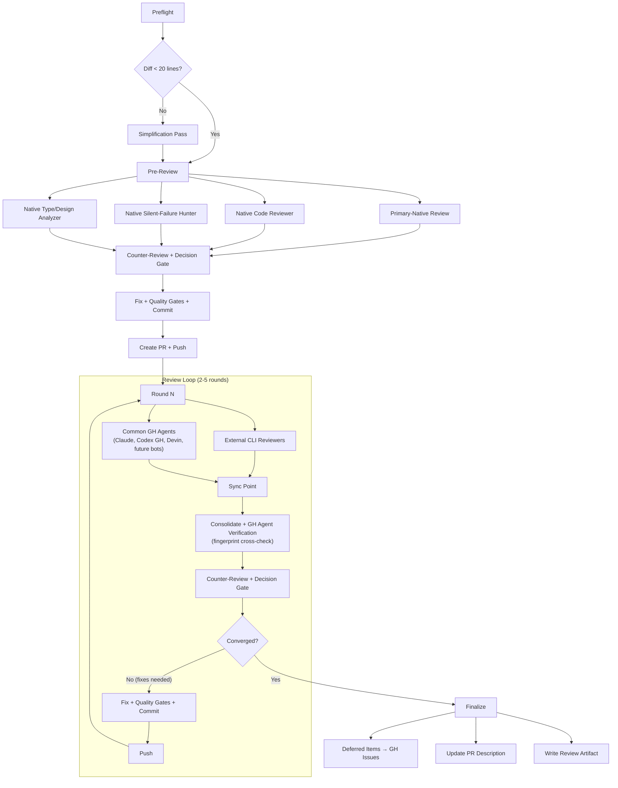
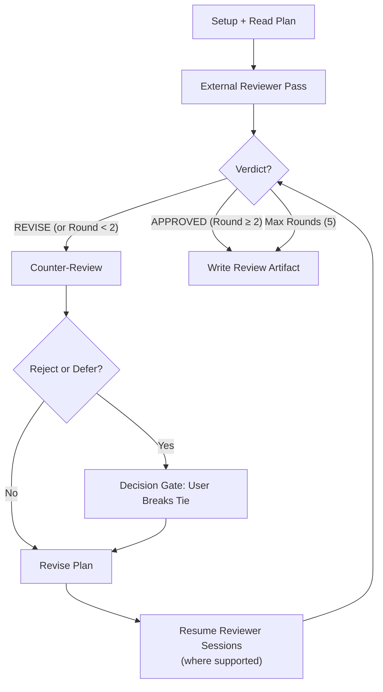
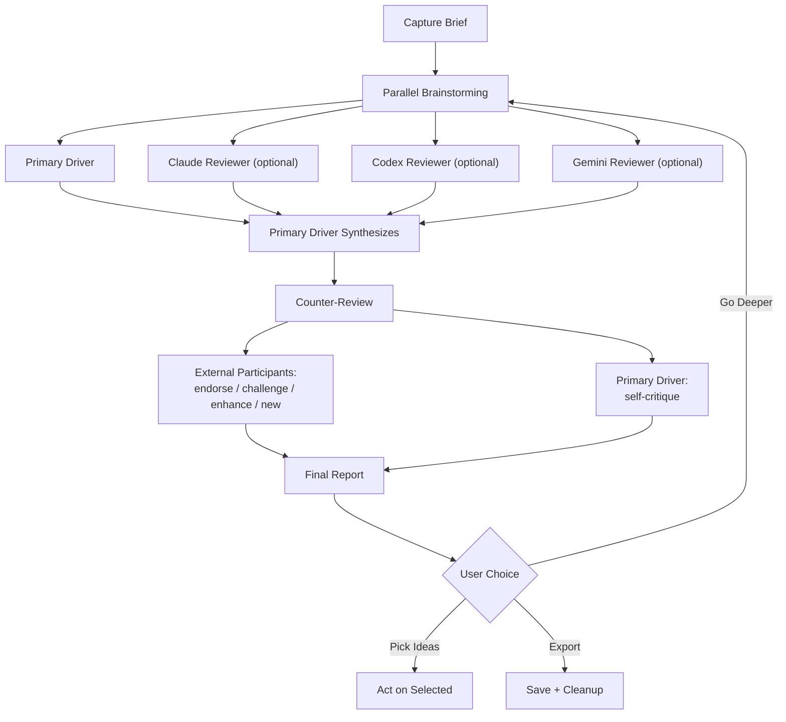
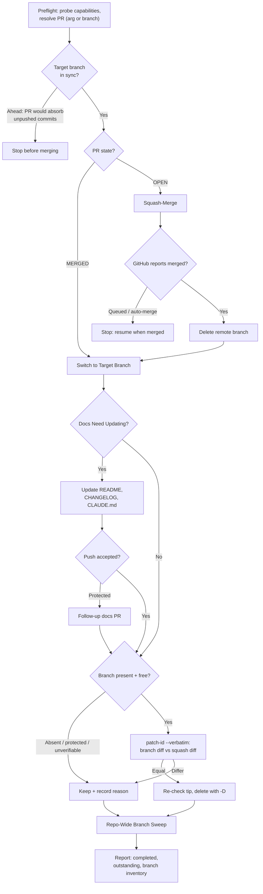
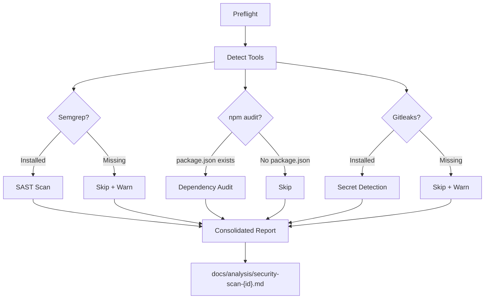
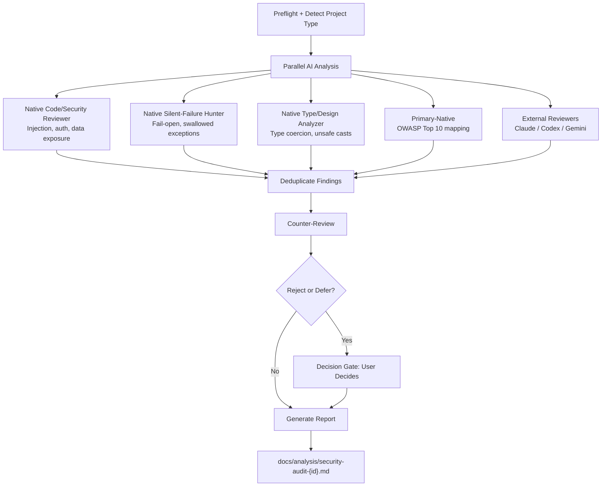
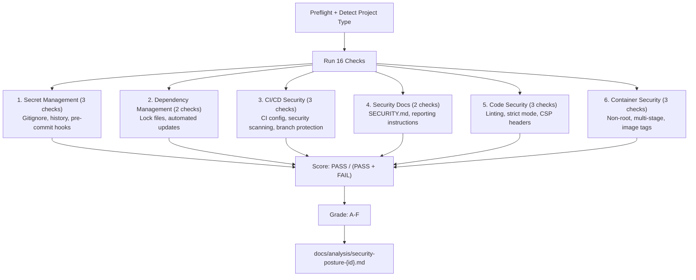
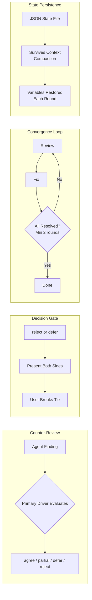

# Skills Guide

Visual flow diagrams for every shipped skill in the Agentic Engineering toolkit. For detailed descriptions and setup instructions, see the [README](../README.md).

## Quick Navigation

| Category | Skills | Pattern |
|----------|--------|---------|
| Collaboration | `/multi-agent-code-review`, `/multi-agent-plan-review`, `/multi-agent-ideate` | Primary driver + reviewer registry + counter-review |
| Workflow | `/merge` | Linear pipeline |
| Security | `/security-scan`, `/security-audit`, `/security-posture` | Analysis + reporting |

---

## Shared Runtime Model

Multi-agent skills use a runtime adapter and reviewer registry instead of assuming one primary agent. The primary driver is detected as `claude-code`, `codex-app`, `codex-cli`, or `unknown`. Reviewers are classified as primary-native, native subagents, external CLI reviewers, GitHub review agents, skipped, or secondary same-family.

External reviewers are advisory by default. A reviewer becomes required only when the user explicitly requests it; skipped advisory reviewers reduce confidence but do not block convergence. When Codex is primary, Claude CLI reviewers run with `--permission-mode plan`, explicit read-only `--allowedTools`, edit/write-denying `--disallowedTools`, and `--output-format json`; they store `externalThreadIds.claude` and resume with `--resume` where the workflow has multiple rounds. Launch Claude CLI from `PROJECT_ROOT` because Claude has no Codex-style `-C` flag.

---

## `/multi-agent-code-review` — Multi-Agent Code Review

Multi-round review across the primary driver, native subagents, external CLI reviewers, and GitHub review agents with counter-review, decision gates, and convergence tracking. Min 2 rounds, max 5.

```mermaid
graph TD
    A[Preflight] --> B{Diff < 20 lines?}
    B -- Yes --> D[Pre-Review]
    B -- No --> C["Simplification Pass"]
    C --> D

    D --> D0[Primary-Native Review]
    D --> D1[Native Code Reviewer]
    D --> D2[Native Silent-Failure Hunter]
    D --> D3[Native Type/Design Analyzer]
    D0 & D1 & D2 & D3 --> E[Counter-Review + Decision Gate]
    E --> F[Fix + Quality Gates + Commit]
    F --> G[Create PR + Push]

    G --> H[Round N]

    subgraph "Review Loop (2-5 rounds)"
        H --> I[External CLI Reviewers]
        H --> J["Common GH Agents\n(Claude, Codex GH, Devin, future bots)"]
        I & J --> K[Sync Point]
        K --> L["Consolidate + GH Agent Verification\n(fingerprint cross-check)"]
        L --> M[Counter-Review + Decision Gate]
        M --> N{Converged?}
        N -- "No (fixes needed)" --> O[Fix + Quality Gates + Commit]
        O --> P[Push]
        P --> H
    end

    N -- Yes --> Q[Finalize]
    Q --> R[Deferred Items → GH Issues]
    Q --> S[Update PR Description]
    Q --> T[Write Review Artifact]
```

> **Requires:** git, gh. Optional: native subagents, Claude/Codex/Gemini CLI reviewers, GitHub bot apps (Claude, Devin, Codex GH)
>
> **Options:** `effort=<fast|balanced|deep>` — cross-agent effort intent. Claude Code also supports `model=<sonnet|opus|haiku>` for compatibility.
>
> **Output:** `docs/reviews/code-review-{id}.md`
>
> **Key features:** Dynamic reviewer registry, common GH agent polling, concrete Claude CLI reviewer channel when Codex is primary, GH finding verification via cross-round fingerprinting, MUST FIX committed before SHOULD FIX (safe rollback)

---

## `/multi-agent-plan-review` — Two-Agent Plan Review

The primary driver sends a plan document to available external reviewers. Each round: reviewers critique, primary driver counter-reviews with dispositions, user resolves disputes, primary driver revises. Min 2 rounds, max 5.

```mermaid
graph TD
    A[Setup + Read Plan] --> B[External Reviewer Pass]
    B --> C{Verdict?}

    C -- "REVISE (or Round < 2)" --> D[Counter-Review]
    D --> E{Reject or Defer?}
    E -- Yes --> F[Decision Gate: User Breaks Tie]
    E -- No --> G[Revise Plan]
    F --> G
    G --> H["Resume Reviewer Sessions\n(where supported)"]
    H --> C

    C -- "APPROVED (Round ≥ 2)" --> I[Write Review Artifact]
    C -- "Max Rounds (5)" --> I
```

> **Requires:** primary driver. Optional: Claude/Codex/Gemini reviewer channels
>
> **Output:** `docs/reviews/plan-review-{id}.md`
>
> **Key features:** reviewer session resume where supported, full audit trail of every finding + disposition + revision

---

## `/multi-agent-ideate` — Multi-Model Brainstorming Council

Available participants brainstorm independently on any topic, then the primary driver synthesizes and each participant counter-reviews. Works with any subset of models.

```mermaid
graph TD
    A[Capture Brief] --> B[Parallel Brainstorming]

    B --> C[Primary Driver]
    B --> D["Claude Reviewer (optional)"]
    B --> E["Codex Reviewer (optional)"]
    B --> F["Gemini Reviewer (optional)"]

    C & D & E & F --> G[Primary Driver Synthesizes]
    G --> H[Counter-Review]

    H --> I["External Participants:\nendorse / challenge / enhance / new"]
    H --> K["Primary Driver:\nself-critique"]

    I & K --> L[Final Report]
    L --> M{User Choice}

    M -- Pick Ideas --> N[Act on Selected]
    M -- Go Deeper --> B
    M -- Export --> O[Save + Cleanup]
```

> **Requires:** primary driver. Optional: Claude/Codex/Gemini reviewer channels
>
> **Options:** `effort=<fast|balanced|deep>`, plus Claude `model=<sonnet|opus|haiku>` compatibility
>
> **Output:** `{review-dir}/report-{id}.md`
>
> **Key features:** Same brief to all models (no cross-contamination), consensus/unique/contested tagging, supports file and image attachments

---

## `/merge` — Squash-Merge with Auto-Documentation

One-command workflow to squash-merge a PR and update all project docs in a single pass. Resumable: re-running after a successful merge picks up at the documentation step.

```mermaid
graph TD
    A["Preflight: probe capabilities,\nresolve PR (arg or branch)"] --> A2{"Target branch\nin sync?"}
    A2 -- "Ahead: PR would absorb\nunpushed commits" --> AZ[Stop before merging]
    A2 -- Yes --> B{PR state?}
    B -- MERGED --> C[Switch to Target Branch]
    B -- OPEN --> M[Squash-Merge]
    M --> N{GitHub reports merged?}
    N -- "Queued / auto-merge" --> Z[Stop: resume when merged]
    N -- Yes --> D[Delete remote branch]
    D --> C
    C --> E{Docs Need Updating?}
    E -- Yes --> F["Update README,\nCHANGELOG, CLAUDE.md"]
    F --> G{Push accepted?}
    G -- Protected --> H[Follow-up docs PR]
    G -- Yes --> I{Branch present + free?}
    E -- No --> I
    H --> I
    I -- "Absent / protected / unverifiable" --> K[Keep + record reason]
    I -- Yes --> J["patch-id --verbatim:\nbranch diff vs squash diff"]
    J -- Equal --> L["Re-check tip, delete with -D"]
    J -- Differ --> K
    L --> O[Repo-Wide Branch Sweep]
    K --> O
    O --> P["Report: completed,\noutstanding, branch inventory"]
```

> **Requires:** git + (gh or GitHub MCP)
>
> **Key features:** Stops before merging when the local target branch is ahead of its remote, because a PR branched from a stale target silently absorbs its unpushed commits into the squash, content-proof branch deletion (`git patch-id --verbatim`, since a squash merge breaks the ancestry that `-d` tests and the default algorithm ignores whitespace), confirms GitHub actually merged rather than queued, repo-wide sweep across local branches, remote branches and stale tracking refs, never deletes a protected or worktree-held branch or one it could not verify, falls back to a follow-up PR when the target rejects direct pushes, reports outstanding work alongside a full branch inventory

---

## `/security-scan` — SAST, Dependencies, and Secrets

Runs available scanning tools and generates a consolidated report. Auto-detects which tools are installed.

```mermaid
graph TD
    A[Preflight] --> B[Detect Tools]

    B --> C{Semgrep?}
    B --> D{npm audit?}
    B --> E{Gitleaks?}

    C -- Installed --> F[SAST Scan]
    C -- Missing --> F2[Skip + Warn]
    D -- "package.json exists" --> G[Dependency Audit]
    D -- "No package.json" --> G2[Skip]
    E -- Installed --> H[Secret Detection]
    E -- Missing --> H2[Skip + Warn]

    F & F2 & G & G2 & H & H2 --> I[Consolidated Report]
    I --> J["docs/analysis/security-scan-{id}.md"]
```

> **Requires:** git + at least one of: Semgrep, Gitleaks, or npm
>
> **Output:** `docs/analysis/security-scan-{id}.md`
>
> **Key features:** Read-only (no code changes), secret values never written to report, non-zero scanner exit codes handled correctly

---

## `/security-audit` — AI-Driven Security Review

Full-codebase security analysis using primary-native analysis, available native subagents, and external reviewer channels with counter-review. Maps findings to OWASP Top 10.

```mermaid
graph TD
    A[Preflight + Detect Project Type] --> B[Parallel AI Analysis]

    B --> C[Native Code/Security Reviewer\nInjection, auth, data exposure]
    B --> D[Native Silent-Failure Hunter\nFail-open, swallowed exceptions]
    B --> E[Native Type/Design Analyzer\nType coercion, unsafe casts]
    B --> F[Primary-Native\nOWASP Top 10 mapping]
    B --> G["External Reviewers\nClaude / Codex / Gemini"]

    C & D & E & F & G --> H[Deduplicate Findings]
    H --> I[Counter-Review]
    I --> J{Reject or Defer?}
    J -- Yes --> K[Decision Gate: User Decides]
    J -- No --> L[Generate Report]
    K --> L

    L --> M["docs/analysis/security-audit-{id}.md"]
```

> **Requires:** git. Optional: Claude/Codex/Gemini reviewer channels
>
> **Options:** `effort=<fast|balanced|deep>`, plus Claude `model=<sonnet|opus|haiku>` compatibility
>
> **Output:** `docs/analysis/security-audit-{id}.md`
>
> **Key features:** Read-only, OWASP Top 10 coverage table, project-type-specific checks (web, node, python, docker), secrets always redacted

---

## `/security-posture` — Security Hygiene Scorecard

Fast infrastructure check across 16 items in 6 categories. Returns a letter grade (A-F) with specific fix recommendations. No scanning tools needed.

```mermaid
graph TD
    A[Preflight + Detect Project Type] --> B[Run 16 Checks]

    B --> C["1. Secret Management (3 checks)\nGitignore, history, pre-commit hooks"]
    B --> D["2. Dependency Management (2 checks)\nLock files, automated updates"]
    B --> E["3. CI/CD Security (3 checks)\nCI config, security scanning, branch protection"]
    B --> F["4. Security Docs (2 checks)\nSECURITY.md, reporting instructions"]
    B --> G["5. Code Security (3 checks)\nLinting, strict mode, CSP headers"]
    B --> H["6. Container Security (3 checks)\nNon-root, multi-stage, image tags"]

    C & D & E & F & G & H --> I["Score: PASS / (PASS + FAIL)"]
    I --> J["Grade: A-F"]
    J --> K["docs/analysis/security-posture-{id}.md"]
```

> **Requires:** git. Optional: gh (for branch protection check)
>
> **Output:** `docs/analysis/security-posture-{id}.md`
>
> **Key features:** Zero dependencies beyond git, N/A checks excluded from scoring, actionable fix commands for every FAIL item

---

## Shared Patterns

Four patterns that appear across multiple skills:

```mermaid
graph LR
    subgraph "Counter-Review"
        CR1[Agent Finding] --> CR2{Primary Driver Evaluates}
        CR2 --> CR3[agree / partial / defer / reject]
    end

    subgraph "Decision Gate"
        DG1[reject or defer] --> DG2[Present Both Sides]
        DG2 --> DG3[User Breaks Tie]
    end

    subgraph "Convergence Loop"
        CL1[Review] --> CL2[Fix]
        CL2 --> CL3{All Resolved?\nMin 2 rounds}
        CL3 -- No --> CL1
        CL3 -- Yes --> CL4[Done]
    end

    subgraph "State Persistence"
        SP1[JSON State File] --> SP2[Survives Context\nCompaction]
        SP2 --> SP3[Variables Restored\nEach Round]
    end
```

| Pattern | Used By | Purpose |
|---------|---------|---------|
| Counter-review | `/multi-agent-code-review`, `/multi-agent-plan-review`, `/security-audit` | Primary driver critically evaluates findings instead of blindly accepting |
| Decision gate | `/multi-agent-code-review`, `/multi-agent-plan-review`, `/security-audit` | Human-in-the-loop only on disagreements |
| Convergence loop | `/multi-agent-code-review`, `/multi-agent-plan-review` | Can't exit until fixes are verified clean |
| State persistence | `/multi-agent-code-review`, `/multi-agent-plan-review`, `/security-audit` | JSON state file survives context window compaction |
